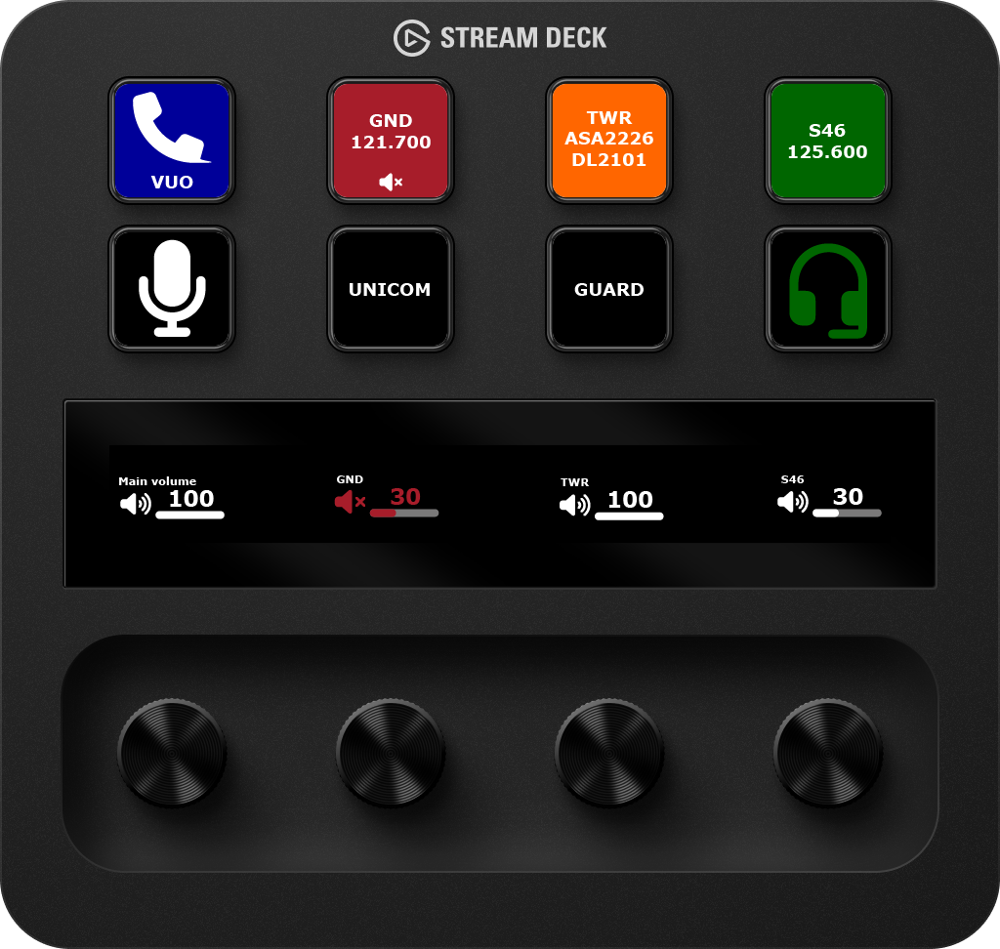
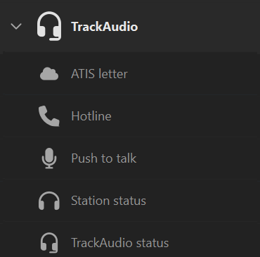
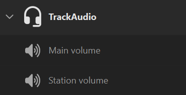



> [!IMPORTANT]
> This plugin requires [TrackAudio beta 1.3.0-beta.5](https://github.com/pierr3/TrackAudio/releases/latest) or later. It will not work with earlier versions of TrackAudio.

This Stream Deck plugin provides actions to interact with TrackAudio.

## Actions

| Action                                 | Description                                                                                                                                                                                                  |
| -------------------------------------- | ------------------------------------------------------------------------------------------------------------------------------------------------------------------------------------------------------------ |
| [ATIS letter](atis-letter)             | Shows the current ATIS letter for a specific station. If you are controlling with [vATIS](https://vatis.app/) use the [vATIS actions for Stream Deck plugin](/docs/streamdeck-vatis) instead of this action. |
| [Hotline](hotline)                     | Switches active TX between two stations, typically a primary controlling position and a secondary hotline position.                                                                                          |
| [Main volume](main-volume)             | Adjust TrackAudio's main volume.                                                                                                                                                                             |
| [Push to talk](push-to-talk)           | Triggers TX on all TX frequencies, as if pressing the push to talk key configured in TrackAudio.                                                                                                             |
| [Station status](station-status)       | Shows the current RX, TX, or XCA for a specific station, last received callsigns, and station frequencies. Supports toggling either mute or station state.                                                   |
| [Station volume](station-volume)       | Adjust a station's volume, or mute a station.                                                                                                                                                                |
| [TrackAudio status](trackaudio-status) | Shows the current state of the connection to TrackAudio from Stream Deck and whether TrackAudio is voice connected to VATSIM.                                                                                |

After installation the plugin actions are available under the TrackAudio category:

 
