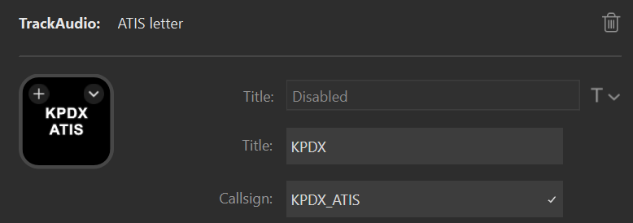

> [!IMPORTANT]
> If you are actively controlling with [vATIS](https://vatis.app/) use the [vATIS actions for Stream Deck plugin](https://github.com/neilenns/streamdeck-vatis) instead to get
> real-time ATIS updates on your Stream Deck.
>
> For this action to work TrackAudio must be running and you must be connected for the ATIS letter to update.
> It can take five minutes or longer for the VATSIM data source to refresh and reflect the latest ATIS letter.

The ATIS letter action shows the current ATIS letter for a station. You can use it to:

- See the current ATIS for a station
- See when a new ATIS is published

## Basic configuration

To configure the action to show the ATIS for a specific station configure the following settings:

| Setting  | Value                                                                     | Example     |
| -------- | ------------------------------------------------------------------------- | ----------- |
| Title    | The title to show on the action, typically the name of the station.       | `KPDX`      |
| Callsign | The station to display. This must match the ATIS position name in VATSIM. | `KPDX_ATIS` |

## States









## Interactions

| Interaction | Description                                                                            |
| ----------- | -------------------------------------------------------------------------------------- |
| Short press | Clears the new ATIS state on the key. This will not clear the new ATIS state in vATIS. |
| Long press  | Refreshes the ATIS state on all actions.                                               |

## Settings reference

| Setting                     | Description                                                                                                       | Required? |
| --------------------------- | ----------------------------------------------------------------------------------------------------------------- | --------- |
| Title                       | The title to show on the action. The current ATIS letter will be appended to this title separated by a newline.   | No.       |
| Callsign                    | The callsign to get the current ATIS letter for, for example `KSEA_ATIS`.                                         | Yes       |
| Current                     | The image to display when the ATIS letter shown is current.                                                       | No        |
| Unavailable                 | The image to display when no ATIS letter is available.                                                            | No        |
| Updated                     | The image to display when the ATIS letter updated to a new one.                                                   | No        |
| Automatically clear updates | Clears the updated state automatically after two minutes. Pressing the action will always clear the update state. | Yes       |
| Show letter                 | Show the letter on the action.                                                                                    | Yes       |
| Show title                  | Show the title on the action.                                                                                     | Yes       |

## SVG template variables

All state images support [SVG templates](../svg-templates/). The following variables are provided:

| Variable | Description                                                      |
| -------- | ---------------------------------------------------------------- |
| callsign | The callsign for the ATIS station.                               |
| letter   | The current ATIS letter, or undefined if no letter is available. |
| state    | The name for the action's current state.                         |
| title    | The title specified by the user.                                 |

The state names are:

- current
- updated
