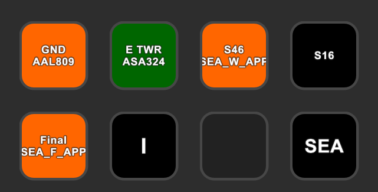
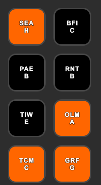

Here are some examples of different profiles people have created using these actions. Have an example you'd like to
share? [Open a new issue](https://github.com/neilenns/streamdeck-trackaudio/issues/new/choose) with a screenshot and
details of how you have the actions configured.

### Seattle tower

Used by a Seattle Tower controller to listen to the controllers working above and below, and to quickly
turn those stations off when it gets busy.

The actions are configured as follows, from left to right, top to bottom.

| Action         | Settings                                                                                                                        |
| -------------- | ------------------------------------------------------------------------------------------------------------------------------- |
| Station status | **Title**: GND, **Callsign**: SEA_GND, **Listen to**: RX, **Show title**: checked, **Show last callsigns**: 1                   |
| Station status | **Title**: E TWR, **Callsign**: SEA_E_TWR, **Listen to**: XCA, **Show title**: checked, **Show last callsigns**: 1              |
| Station status | **Title**: S46, **Callsign**: SEA_W_APP, **Listen to**: RX, **Show title**: checked, **Show last callsigns**: 1                 |
| Station status | **Title**: S16, **Callsign**: SEA_CTR, **Listen to**: RX, **Show title**: checked, **Show last callsigns**: 1                   |
| Station status | **Title**: Final, **Callsign**: SEA_F_APP, **Listen to**: RX, **Show title**: checked, **Show last received callsign**: checked |
| ATIS letter    | **Title**: _blank_, **Callsign**: KSEA_ATIS, **Show title**: unchecked, **Show letter**: checked                                |
| Switch profile | **Title**: SEA                                                                                                                  |

### Seattle final approach - ATIS letters

Used by a final approach controller to keep an eye on the current ATIS letter for all the satellite fields around KSEA.

The actions are configured as follows, from left to right, top to bottom.

| Action      | Settings                                                                                   |
| ----------- | ------------------------------------------------------------------------------------------ |
| ATIS letter | **Title**: SEA, **Callsign**: KSEA_ATIS, **Show title**: checked, **Show letter**: checked |
| ATIS letter | **Title**: BFI, **Callsign**: KBFI_ATIS, **Show title**: checked, **Show letter**: checked |
| ATIS letter | **Title**: PAE, **Callsign**: KPAE_ATIS, **Show title**: checked, **Show letter**: checked |
| ATIS letter | **Title**: RNT, **Callsign**: KRNT_ATIS, **Show title**: checked, **Show letter**: checked |
| ATIS letter | **Title**: TIW, **Callsign**: KTIW_ATIS, **Show title**: checked, **Show letter**: checked |
| ATIS letter | **Title**: OLM, **Callsign**: KOLM_ATIS, **Show title**: checked, **Show letter**: checked |
| ATIS letter | **Title**: TCM, **Callsign**: KTCM_ATIS, **Show title**: checked, **Show letter**: checked |
| ATIS letter | **Title**: GRF, **Callsign**: KGRF_ATIS, **Show title**: checked, **Show letter**: checked |
