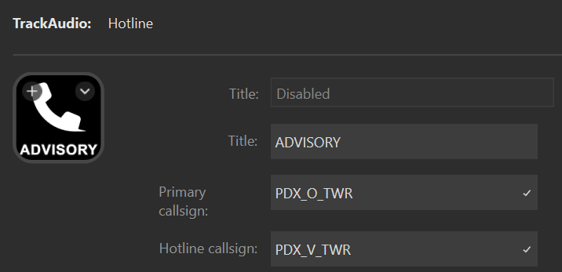



The hotline action provides a quick way to toggle between two stations for voice transmissions. You can use it to:

- Control on your primary frequency while listening to a hotline frequency, and quickly swap TX between the two when you need to talk on the hotline (e.g. controlling `SEA_CTR` and a `ZOA-ZSE` hotline).
- Control on your primary frequency while listening to a satellite field, and quickly swap TX between the two when you need to talk to a pilot at the satellite. (e.g. controlling Portland Tower on `PDX_O_TWR` and listening to Pearson Advisory on `PDX_V_TWR`)

## Basic configuration

Start by adding the appropriate stations to TrackAudio. Your primary station should
be added with `XCA` enabled and the hotline station should be added with `RX` enabled. Then configure the hotline action with the primary and hotline station callsigns:

| Setting          | Description                                         | Example     |
| ---------------- | --------------------------------------------------- | ----------- |
| Title            | The title to show on the action.                    | `ADVISORY`  |
| Primary callsign | The callsign in TrackAudio for the primary station. | `PDX_O_TWR` |
| Hotline callsign | The callsign in TrackAudio for the hotline station. | `PDX_V_TWR` |

## States

















## Interactions

| Interaction | Description                                                                   |
| ----------- | ----------------------------------------------------------------------------- |
| Short press | Swaps the active `TX` state between the primary and hotline stations.         |
| Long press  | Enables `TX` on the primary station and disables `TX` on the hotline station. |

## Settings reference

| Setting               | Description                                                                                                                                                                                        | Required |
| --------------------- | -------------------------------------------------------------------------------------------------------------------------------------------------------------------------------------------------- | -------- |
| Primary callsign      | The callsign you are actively controlling, for example `SEA_CTR`.                                                                                                                                  | Yes.     |
| Hotline callsign      | The callsign for the hotline, for example `ZOA-ZSE`.                                                                                                                                               | Yes      |
| Both active           | The image to display when both the primary and hotline and frequencies are the active frequency. This should never happen, as it means your voice transmissions will get sent to both frequencies. | No       |
| Hotline active        | The image to display when transmitting on the hotline frequency.                                                                                                                                   | No       |
| Listening             | The image to display when listening to the hotline frequency.                                                                                                                                      | No       |
| Neither active        | The image to display when neither the primary nor the hotline frequencies have TX enabled.                                                                                                         | No       |
| Receiving             | The image to display when receiving a transmission on the hotline frequency.                                                                                                                       | No       |
| Unavailable           | The image to display when the primary and hotline stations are not added in TrackAudio.                                                                                                            | No       |
| Show hotline callsign | Show the hotline callsign on the action. Default `off`.                                                                                                                                            | Yes      |
| Show primary callsign | Show the primary callsign on the action. Default `off`.                                                                                                                                            | Yes      |
| Show title            | Show the title on the action. Default `on`.                                                                                                                                                        | Yes      |
