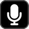

## Configuring a push to talk action

The push to talk action does not require configuration for use. Simply add it to your profile, then press the action to start transmitting.

| Setting          | Description                                 | Default                                                    |
| ---------------- | ------------------------------------------- | ---------------------------------------------------------- |
| Title            | The title to show on the action. Optional.  |                                                            |
| Not transmitting | Shown when idle. Optional.                  |           |
| Transmitting     | Shown when actively transmitting. Optional. |  |
| Show title       | Show the title on the action.               | false                                                      |
