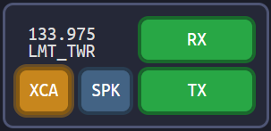
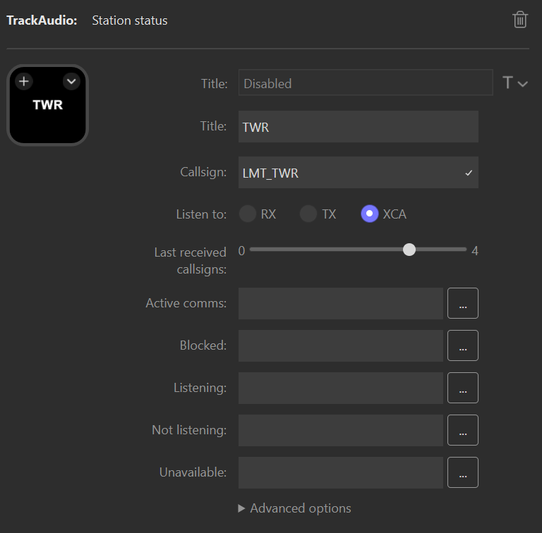
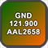
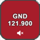
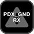

The station status action displays the current status of a single station's button in TrackAudio, including whether communication is currently active. It also automatically adds the station to TrackAudio after a voice connection is established.

Pressing the action will either toggle the equivalent button in TrackAudio or mute the station's audio. A long press of the action will refresh the action's state.

For example, if you are controlling `LMT_TWR` and have TrackAudio set up like this:

configure the station status action like this to show that RX is enabled and the last received callsign:

> [!IMPORTANT]
> The action lights up when transmissions occur on the _frequency_ of the callsign. This means if two stations share the same frequency (e.g. `PDX_GND` and `GEG_GND`) the action will light up when transmissions happen on either of those stations.

### Station status settings <!-- omit from toc -->

| Setting                           | Description                                                                                                                                                                                                                  | Default                                                        |
| --------------------------------- | ---------------------------------------------------------------------------------------------------------------------------------------------------------------------------------------------------------------------------- | -------------------------------------------------------------- |
| Title                             | The title to show on the action. Optional.                                                                                                                                                                                   | Station callsign and listen to value                           |
| Callsign                          | The callsign for the station you want to display status for. Required.                                                                                                                                                       |                                                                |
| Listen to                         | What status to display on the button, either RX, TX, or XCA. Required.                                                                                                                                                       | RX                                                             |
| Last received callsigns           | Sets the number of last received callsigns to display, newest to oldest, and will age off after five minutes. Only supported when listen to is set to `RX` or `XCA`. If set to `0` no last received callsigns will be shown. | `0`                                                            |
| Toggle mute when pressed          | Toggles mute for the station when the action is pressed instead of toggling the configured listen to button.                                                                                                                 | false                                                          |
| Active comms                      | The image to display when a transmission is actively taking place. Optional.                                                                                                                                                 |               |
| Blocked                           | The image to display when both an aircraft and the ATC position are transmitting at the same time. Optional.                                                                                                                 |  |
| Listening                         | The image to display when the station is active. Optional.                                                                                                                                                                   |                |
| Muted                             | The iamge to display when the station is muted. Optional.                                                                                                                                                                    |       |
| Not listening                     | The image to display when the station is not currently active. Optional.                                                                                                                                                     |             |
| Unavailable                       | The image to display when the station is not added in TrackAudio. Optional, defaults to a warning icon.                                                                                                                      |                  |
| Automatically enable speaker mode | Enables speaker mode on the station after a TrackAudio voice connection is established                                                                                                                                       | false                                                          |
| Automatically set Rx mode         | Enables Rx mode on the station after a TrackAudio voice connection is established                                                                                                                                            | false                                                          |
| Show callsign                     | Show the callsign on the action.                                                                                                                                                                                             | false                                                          |
| Show frequency                    | Show the callsign's frequency on the action.                                                                                                                                                                                 | false                                                          |
| Show listen to                    | Show the listen to value on the action.                                                                                                                                                                                      | false                                                          |
| Show title                        | Show the title on the action.                                                                                                                                                                                                | true                                                           |
| Clear callsigns after (minutes)   | How long to leave callsigns displayed before they age off. Set to 0 to persist callsigns until they are pushed by newer callsigns.                                                                                           | 3 minutes                                                      |
