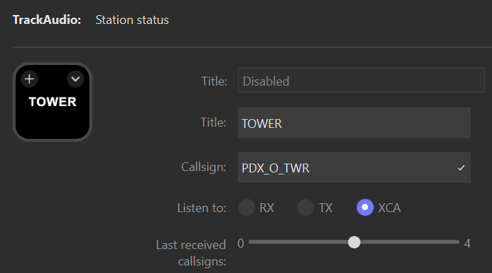
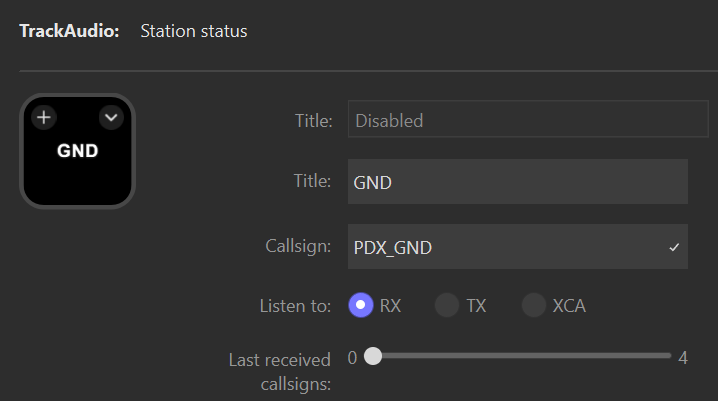



The station status action displays the current status of a single station's button in TrackAudio. You can use it to:

- Toggle TX, RX, or XCA state of a station.
- See when a transmission is happening on a frequency.
- See the last received callsigns for a station.
- See the frequency of a station.
- Toggle mute on a station.
- Automatically add a station to TrackAudio when it connects.
- Automatically enable speaker (SPK) mode on a station when TrackAudio connects.
- Automatically enable receive (RX) mode on a station when TrackAudio connects.

> [!IMPORTANT]
> The action lights up when transmissions occur on the _frequency_ of the callsign. This means if two stations share the same frequency (e.g. `PDX_GND` and `GEG_GND`) the action will light up when transmissions happen on either of those stations.

## Basic configuration

The station status action is useful in a wide range of situations. The following sections provide basic configurations for common use cases.

### Primary station with last received callsigns

To configure the action to show the last received callsigns on your primary station enabled for XCA in TrackAudio configure the following settings:

| Setting                 | Description                                                         | Example     |
| ----------------------- | ------------------------------------------------------------------- | ----------- |
| Title                   | The title to show on the action, typically the name of the station. | `TOWER`     |
| Callsign                | The callsign in TrackAudio for the station.                         | `PDX_O_TWR` |
| Listen to               | The TrackAudio mode the action should follow.                       | `XCA`       |
| Last received callsigns | The number of last received callsigns to show on the action.        | `3`         |

### Secondary station with frequency display

If you enjoy listening to other controllers you can configure the station status action to display the frequency for their stations and quickly toggle Rx to stop listening when you get busy on your own frequency. Assuming the secondary station is in TrackAudio with RX and SPK enabled configure the following settings:

| Setting        | Description                                                                                 | Example   |
| -------------- | ------------------------------------------------------------------------------------------- | --------- |
| Title          | The title to show on the action, typically the name of the station                          | `GROUND`  |
| Callsign       | The callsign in TrackAudio for the station.                                                 | `PDX_GND` |
| Listen to      | The TrackAudio mode the action should follow.                                               | `RX`      |
| Show title     | Enables display of the action's title. This setting is located under advanced options.      | Checked   |
| Show frequency | Enables display of the station's frequency. This setting is located under advanced options. | Checked   |

### Secondary station with auto-add, auto-RX, auto-speaker, and press to mute

To save time when connecting to the network the station status action can be configured to automatically add the station to TrackAudio and enable RX and SPK modes. This is convenient when you have a set of stations you always like to listen to while controlling your primary position, for example listening to ground and approach while working tower. Configure the action with the following settings:

| Setting                           | Description                                                                                                   | Example   |
| --------------------------------- | ------------------------------------------------------------------------------------------------------------- | --------- |
| Title                             | The title to show on the action, typically the name of the station                                            | `GROUND`  |
| Callsign                          | The callsign in TrackAudio for the station.                                                                   | `PDX_GND` |
| Listen to                         | The TrackAudio mode the action should follow.                                                                 | `RX`      |
| Show title                        | Enables display of the action's title. This setting is located under advanced options.                        | Checked   |
| Automatically enable speaker mode | Automatically turns on speaker mode when TrackAudio connects. This setting is located under advanced options. | Checked   |
| Automatically set Rx mode         | Automatically turns on RX mode when TrackAudio connects. This setting is located under advanced options.      | Checked   |
| Toggle mute when pressed          | Toggles the mute state for the station instead of toggling RX mode.                                           | Checked   |

## States



<!-- activeComms -->



<!-- blocking -->



<!-- listening -->



<!-- muted -->



<!-- notListening -->



<!-- unavailable -->





## Interactions

| Interaction | Description                                                                                                 |
| ----------- | ----------------------------------------------------------------------------------------------------------- |
| Short press | Toggles the `Listen to` button in TrackAudio, or mutes the station audio if enabled in the action settings. |
| Long press  | Refreshes the action's state.                                                                               |

## Settings reference

| Setting                           | Description                                                                                                                                                                                                                  | Required |
| --------------------------------- | ---------------------------------------------------------------------------------------------------------------------------------------------------------------------------------------------------------------------------- | -------- |
| Title                             | The title to show on the action.                                                                                                                                                                                             | No       |
| Callsign                          | The callsign for the station you want to display status for.                                                                                                                                                                 | Yes      |
| Listen to                         | What status to display on the button, either RX, TX, or XCA.                                                                                                                                                                 | Yes      |
| Last received callsigns           | Sets the number of last received callsigns to display, newest to oldest, and will age off after five minutes. Only supported when listen to is set to `RX` or `XCA`. If set to `0` no last received callsigns will be shown. | Yes      |
| Toggle mute when pressed          | Toggles mute for the station when the action is pressed instead of toggling the configured listen to button.                                                                                                                 | Yes      |
| Active comms                      | The image to display when a transmission is actively taking place.                                                                                                                                                           | No       |
| Blocked                           | The image to display when both an aircraft and the ATC position are transmitting at the same time.                                                                                                                           | No       |
| Listening                         | The image to display when the station is active.                                                                                                                                                                             | No       |
| Muted                             | The image to display when the station is muted.                                                                                                                                                                              | No       |
| Not listening                     | The image to display when the station is not currently active.                                                                                                                                                               | No       |
| Unavailable                       | The image to display when the station is not added in TrackAudio.                                                                                                                                                            | No       |
| Automatically enable speaker mode | Enables speaker mode on the station after a TrackAudio voice connection is established                                                                                                                                       | false    |
| Automatically set Rx mode         | Enables Rx mode on the station after a TrackAudio voice connection is established.                                                                                                                                           | Yes      |
| Show callsign                     | Show the callsign on the action.                                                                                                                                                                                             | Yes      |
| Show frequency                    | Show the callsign's frequency on the action.                                                                                                                                                                                 | Yes      |
| Show listen to                    | Show the listen to value on the action.                                                                                                                                                                                      | Yes      |
| Show title                        | Show the title on the action.                                                                                                                                                                                                | Yes      |
| Clear callsigns after (minutes)   | How long to leave callsigns displayed before they age off. Set to 0 to persist callsigns until they are pushed by newer callsigns.                                                                                           | Yes      |
