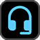
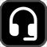
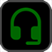



The TrackAudio status action shows the status of the connection between Stream Deck and TrackAudio, and whether the voice connection in TrackAudio is up. A long press of the action will force a refresh of all the Stream Deck TrackAudio actions.

### TrackAudio status action settings <!-- omit from toc -->

| Setting         | Description                                                                    | Default                                                               |
| --------------- | ------------------------------------------------------------------------------ | --------------------------------------------------------------------- |
| Connected       | The image to display when connected to TrackAudio. Optional.                   |        |
| Not connected   | The image to display when not connected to TrackAudio. Optional.               |    |
| Voice connected | The image to display when the TrackAudio voice connection is active. Optional. |  |
| Show title      | Show the title on the action.                                                  | false                                                                 |
