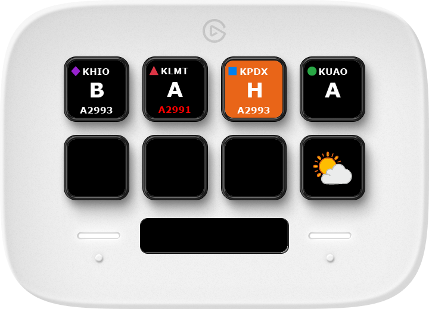
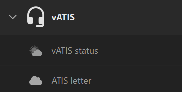



> [!IMPORTANT]
> This plugin requires [vATIS v4.1.0-beta.8](https://vatis.app/) or later.

This Stream Deck plugin provides actions to interact with [vATIS](https://vatis.app/) running on your local machine.

## Actions

| Action                        | Description                                                          |
| ----------------------------- | -------------------------------------------------------------------- |
| [ATIS letter](atis-letter/)   | Shows the current ATIS letter and altimeter for a specific station.  |
| [vATIS status](vatis-status/) | Shows the current state of the connection to vATIS from Stream Deck. |

After installation the plugin actions are available under the vATIS category:

