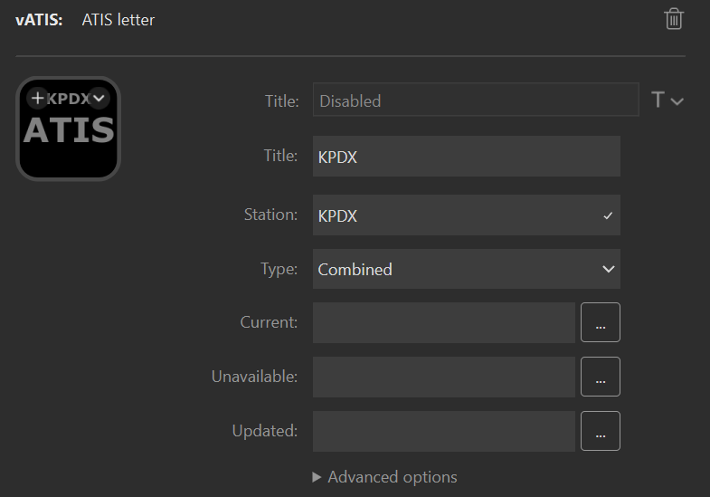
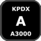
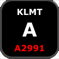

The ATIS letter action shows the current ATIS information for the specified station. You can use it to:

- See the current ATIS letter for a station
- See the current altimeter for a station
- Get warned if the pressure falls below 29.92 InHg as a reminder that FL180 (or FL190) is unavailable
- Get notified when a new ATIS is published
- Clear the new ATIS notification for a station
- Clear the new ATIS notification for all stations

## Prerequisites

To use this action you must have [vATIS](https://vatis.app) running and you must be connected to VATSIM as either a controller or an observer. The action can show current the ATIS for any station in the active vATIS profile. 

## Basic configuration

To configure the action to show the ATIS for a specific station configure the following settings:

| Setting   | Value                                                                                                                                             | Example    |
| --------- | ------------------------------------------------------------------------------------------------------------------------------------------------- | ---------- |
| Title     | The title to show on the action, typically the name of the station.                                                                               | `KPDX`     |
| Station   | The station to display. This must match the station name shown in vATIS.                                                                          | `KPDX`     |
| ATIS type | The station type. This will usually be `Combined` unless the ATIS is at an airport that publishes separate `Arrival` and `Departure` information. | `Combined` |

## States

By default the pressure displays in white. For pressure reported in InHg, if the value falls below 29.92 the value will show in red as a reminder that FL180 (or FL190, depending on the altimeter value) are unusable.

## Interactions

The action supports both short and long press.

| Interaction | Description                                      |
| ----------- | ------------------------------------------------ |
| Short press | Clears the new ATIS indication for the station.  |
| Long press  | Clears the new ATIS indication for all stations. |

## Settings reference

| Setting     | Description                                                               | Default                                                                                                                                    |
| ----------- | ------------------------------------------------------------------------- | ------------------------------------------------------------------------------------------------------------------------------------------ |
| Title       | The title to show on the action. Optional.                                |                                                                                                                                            |
| Station     | The name of the station you want to display status for. Required.         |                                                                                                                                            |
| Type        | The type of the station.                                                  | `Combined`                                                                                                                                 |
| Current     | The image to display when the ATIS letter shown is current. Optional.     |   |
| Unavailable | The image to display when there is no connection to vATIS. Optional.      |                                                             |
| Updated     | The image to display when the ATIS letter updated to a new one. Optional. |                                                                                   |

The default display automatically includes the station name, ATIS letter, and altimeter. When specifying
custom state images the following advanced settings can be used to display text on the action:

| Setting        | Description                        | Default |
| -------------- | ---------------------------------- | ------- |
| Show altimeter | Shows the altimeter on the action. | off     |
| Show letter    | Shows the letter on the action.    | off     |
| Show title     | Shows the title on the action.     | off     |
| Show wind      | Shows the wind on the action.      | off     |
