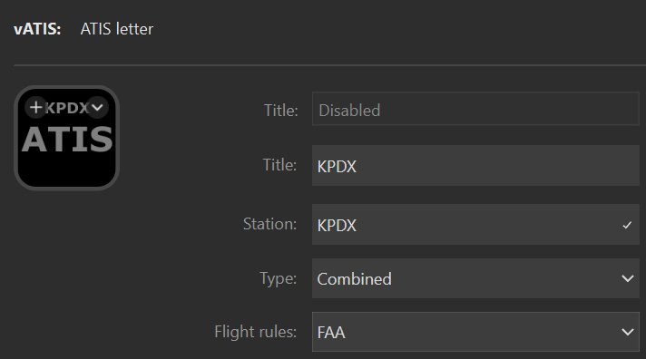



The ATIS letter action shows the current ATIS information for the specified station. You can use it to:

- See the current ATIS letter for a station
- See the current altimeter for a station
- Get warned if the pressure falls below 29.92 InHg as a reminder that FL180 (or FL190) is unavailable
- Get notified when a new ATIS is published
- Clear the new ATIS notification for a station
- Clear the new ATIS notification for all stations

## Prerequisites

To use this action you must have [vATIS](https://vatis.app) running and you must be connected to VATSIM as either a controller or an observer. The action can show current the ATIS for any station in the active vATIS profile.

## Basic configuration

To configure the action to show the ATIS for a specific station configure the following settings:

| Setting   | Value                                                                                                                                             | Example    |
| --------- | ------------------------------------------------------------------------------------------------------------------------------------------------- | ---------- |
| Title     | The title to show on the action, typically the name of the station.                                                                               | `KPDX`     |
| Station   | The station to display. This must match the station name shown in vATIS.                                                                          | `KPDX`     |
| ATIS type | The station type. This will usually be `Combined` unless the ATIS is at an airport that publishes separate `Arrival` and `Departure` information. | `Combined` |

## States



<!-- Unavailable -->



<!-- Available, not published -->



<!-- Available -->



<!-- Available, pressure warning -->



<!-- Available, published, new -->



<!-- Available, published, new, pressure warning -->




By default the pressure displays in white. For pressure reported in InHg, if the value falls below 29.92 the value will show in red as a reminder that FL180 (or FL190, depending on the altimeter value) are unusable.

If enabled the current FAA flight rules for the station will display in the top left:







 







## Interactions

The action supports both short and long press.

| Interaction | Description                                      |
| ----------- | ------------------------------------------------ |
| Short press | Clears the new ATIS indication for the station.  |
| Long press  | Clears the new ATIS indication for all stations. |

## Settings reference

| Setting                         | Description                                                                                                         | Required? |
| ------------------------------- | ------------------------------------------------------------------------------------------------------------------- | :-------: |
| Title                           | The title to show on the action.                                                                                    |    No     |
| Station                         | The name of the station you want to display status for.                                                             |    Yes    |
| Type                            | The type of the station.                                                                                            |    Yes    |
| Show FAA flight rules indicator | Shows an indicator in the top right for the current FAA flight rules based on ceiling and visibility. Default `on`. |    No     |
| Current                         | The image to display when the ATIS letter shown is current.                                                         |    No     |
| Observer                        | The image to display when the ATIS is published by a controller other than you.                                     |    No     |
| Unavailable                     | The image to display when there is no connection to vATIS.                                                          |    No     |
| Updated                         | The image to display when the ATIS letter updated to a new one.                                                     |    No     |

The default display automatically includes the station name, ATIS letter, and altimeter. When specifying
custom state images the following advanced settings can be used to display text on the action:

| Setting        | Description                        | Default |
| -------------- | ---------------------------------- | ------- |
| Show altimeter | Shows the altimeter on the action. | `off`   |
| Show letter    | Shows the letter on the action.    | `off`   |
| Show title     | Shows the title on the action.     | `off`   |
| Show wind      | Shows the wind on the action.      | `off`   |

## SVG template variables

All state images support [SVG templates](../svg-templates/). The following variables are provided:

| Variable           | Description                                                   |
| ------------------ | ------------------------------------------------------------- |
| altimeter          | The current altimeter.                                        |
| connectionStatus   | The current station connection status.                        |
| faaFlightRules     | The current FAA flight rules based on ceiling and visibility. |
| isConnected        | True if the station is connected to VATSIM.                   |
| isNewAtis          | True if the ATIS letter is new.                               |
| letter             | The current ATIS letter.                                      |
| pressure           | A pressure object with the altimeter details.                 |
| showFaaFlightRules | True if the FAA flight rules should be shown.                 |
| station            | The station name.                                             |
| title              | The title specified by the user.                              |
| wind               | The current wind.                                             |

The connectionStatus values are:

- Connected
- Connecting
- Disconnected
- Observer

The faaFlightRules values are:

- IFR
- LIFR
- MVFR
- UNKNOWN
- VFR

The pressure object contains the following properties:

| Property       | Description                                                                                  |
| -------------- | -------------------------------------------------------------------------------------------- |
| formattedValue | A formatted display of the pressure, either A2999 or Q910 for example depending on the unit. |
| value          | The value of the pressure, without a decimal point, e.g. 2999.                               |
| unit           | The unit for the pressure, either `MercuryInch` or `hPa`.                                    |
