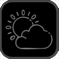

The vATIS status action shows the state of the connection to the vATIS application. You can use it to:

- Verify your Stream Deck is connected to vATIS
- Force all vATIS actions to refresh their state

## Prerequisites

To use this action you must have [vATIS](https://vatis.app) running.

## Basic configuration

This action does not require any configuration to use.

## States

Colorful sun and cloud means connected. Sad grey cloud means not connected.

## Interactions

The action supports long press.

| Interaction | Description                        |
| ----------- | ---------------------------------- |
| Long press  | Refreshes all ATIS letter actions. |

## Settings reference

| Setting       | Description                                                 | Default                                                                     |
| ------------- | ----------------------------------------------------------- | --------------------------------------------------------------------------- |
| Title         | The title to show on the action. Optional.                  | Blank                                                                       |
| Connected     | The image to display when connected to vATIS. Optional.     |         |
| Not connected | The image to display when not connected to vATIS. Optional. |  |
| Show title    | Shows the title on the action.                              | false                                                                       |
