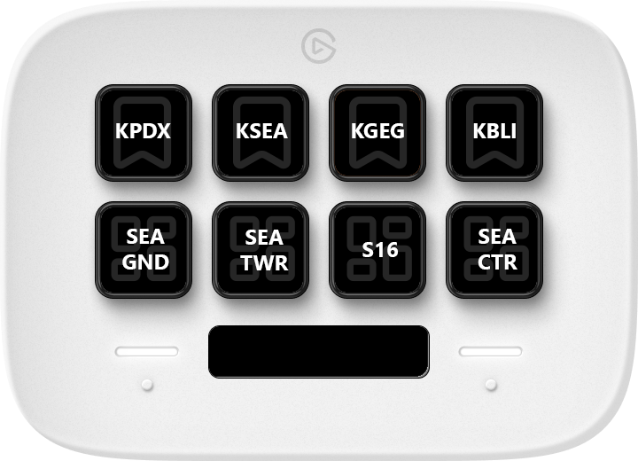
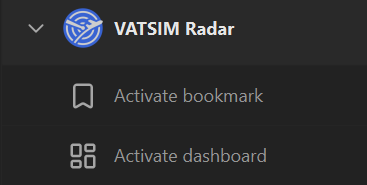



> [!IMPORTANT]
> This plugin requires the [VATSIM Radar desktop app](https://www.vatsim-radar.com/download).

This Stream Deck plugin provides actions to interact with [VATSIM Radar](https://www.vatsim-radar.com/) running on your local machine.

## Actions

| Action                                    | Description                         |
| ----------------------------------------- | ----------------------------------- |
| [Activate bookmark](activate-bookmark/)   | Activates a VATSIM Radar bookmark.  |
| [Activate dashboard](activate-dashboard/) | Activates a VATSIM Radar dashboard. |

After installation the plugin actions are available under the VATSIM Radar category:

