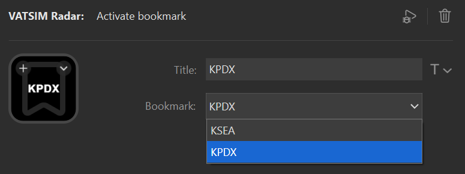



The activate bookmark action opens a bookmark configured in VATSIM Radar.

## Prerequisites

To use this action you must have the [VATSIM Radar desktop app](https://vatsim-radar.com/download) running.

## Basic configuration

To configure the action to activate a bookmark use the following settings:

| Setting  | Value                                                                                                                 | Example |
| -------- | --------------------------------------------------------------------------------------------------------------------- | ------- |
| Title    | The title to show on the action, typically the name of the bookmark.                                                  | `KPDX`  |
| Bookmark | The bookmark to activate. The list will display all bookmarks for the user logged in to the VATSIM Radar desktop app. | `KPDX`  |

## Interactions

The action supports short press.

| Interaction | Description             |
| ----------- | ----------------------- |
| Short press | Activates the bookmark. |

## Settings reference

| Setting  | Value                                                                                                                 | Example |
| -------- | --------------------------------------------------------------------------------------------------------------------- | ------- |
| Title    | The title to show on the action, typically the name of the bookmark.                                                  | `KPDX`  |
| Bookmark | The bookmark to activate. The list will display all bookmarks for the user logged in to the VATSIM Radar desktop app. | `KPDX`  |
